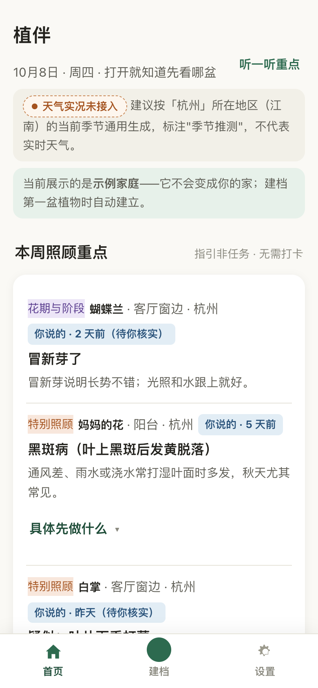
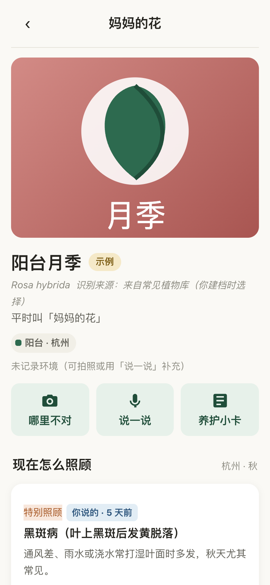

# 植伴 · zhiban

> 帮中文家庭管好已经种下的每一盆植物：按摆放位置建档、症状排查、看天建议、生成可打印的「五行养护小卡」。
> **它不是植物百科，也不需要每天打卡。**

[](./LICENSE)
[](#)
[](#测试与质量保障)
[](#快速开始)

**一句话版本**：手机上打开的植物养护小应用——数据留在你自己设备上、无账号无云端；给每盆植物建档案、看本周该关注什么、叶子出问题勾症状查原因；能整屋拍照批量建档；能看真实天气调整建议；能生成挂在花盆上的五行小卡。

| 首页 · 本周照顾重点 | 植物档案 · 五行小卡 |
|---|---|
|  |  |

## 目录

1. [它适合谁](#它适合谁)
2. [核心功能一览](#核心功能一览)
3. [快速开始](#快速开始)
4. [第一次上手](#第一次上手3-步)
5. [你的数据在哪](#你的数据在哪)
6. [功能详解](#功能详解) ｜ [还没接入的（如实清单）](#还没接入的如实清单) ｜ [刻意不做的（红线）](#刻意不做的红线清单)
7. [目录结构](#目录结构) ｜ [测试与质量保障](#测试与质量保障)
8. [部署到公网](#部署到公网) ｜ [接入真实识别与天气](#接入真实识别与天气) ｜ [小程序迁移参考](#小程序迁移参考)
9. [版本历史与工程核查](#版本历史与工程核查)
10. [许可](#许可)

---

## 它适合谁

**适合**：

- 家里养了几盆到几十盆植物的中文家庭——想记住每盆是什么、放在哪、该怎么养
- 想给爸妈用一个"不用注册、不怕忘了密码"的植物小工具（打开浏览器就在）
- 新手 gardener：内置 13 种家常植物（绿萝/月季/多肉/茉莉/白掌…）的养护知识，位置环境不同建议也不同
- 不想被浇水打卡、每日提醒绑架的人——本应用刻意没有这些
- 在意数据主权的人：所有档案和照片只存在你的设备上，随时导出、随时删除

**不适合**：

- 想要植物百科/图鉴（不含大而全的物种数据库）
- 想多人在线协作、家人共享同步（家人共享未实现，不放无效按钮）
- 想不申请任何 API 密钥就获得真实 AI 识别（识别质量依赖自己部署的服务端与密钥；不开箱即真）

## 核心功能一览

- **本周照顾重点**：季节 × 城市 × 种类 × 位置 × 近 30 天有效观察 → 首页直接告诉你"这周最该做什么"；没有不凑数
- **拍照建档**：相机/相册多张照片归一盆；也支持不拍照纯手填
- **整屋批量建档**：一张/几张照片里的多盆植物自动定位+候选名，人工确认后一批建独立档案（可删误检、可合并重复）
- **症状排查**：勾现象（叶片下垂/黄叶/焦尖…）→ 少量追问 → 组合推理建议；不确诊、不给农药剂量
- **空间驱动建议**：同名"阳台"一个露天一个封闭，给完全不同的建议；冬天不会建议怕寒植物露天过冬
- **五行养护小卡**：正好 5 行、每行 ≤10 字的大字卡（含运行时硬校验），可复制/存黑白图，打印挂盆上
- **真实天气接入位**：配置和风天气后，登记"会淋雨"的位置雨天自动收到提醒；室内盆绝不因天气收到无关键目
- **PWA**：手机浏览器"添加到主屏幕"后像 App 一样打开；离线可看已建档内容（识别/天气联网功能如实提示离线）

---

## 快速开始

### A · 3 分钟体验（推荐第一次来的人）

前置：装好 [Node.js 18+](https://nodejs.org/)。无需任何密钥。

```bash
git clone https://github.com/soyoungzsy6-ops/zhiban.git
cd zhiban
MOCK_VISION=1 node server/server.js
```

看到 `植伴代理已启动: http://127.0.0.1:8438` 后，浏览器打开：

```
http://127.0.0.1:8438/?demo=1
```

**预期效果**：绿色头部的"植伴"首页 + 示例之家（妈妈的花·月季、绿萝等）+ 本周照顾重点。识别为演示模式（页面明示"非真实识别"）。
手机体验：手机与电脑同一 Wi-Fi，地址换 `http://<电脑IP>:8438/?demo=1`。

### B · 完整开发（跑全部测试）

前置：Node 18+；浏览器验证还需要本机 [Google Chrome](https://www.google.com/chrome/)（脚本按 macOS 默认路径找它，其他系统改脚本顶部 `CHROME` 常量）。

```bash
npm ci                 # 安装测试依赖（应用本体零 npm 依赖）
npm test               # 逻辑测试：10 个文件 313 项断言

MOCK_VISION=1 PORT=8438 node server/server.js &   # 演示代理（或另开终端跑）
node test/verify-v4.mjs                            # Chrome 实测 19 项

API_ACCESS_KEY=test123 MOCK_VISION=1 PORT=8439 node server/server.js &
node test/verify-pwa.mjs                           # Chrome 实测 23 项（PWA/白名单/key/离线/更新）
```

### 接入真实识别与天气（可选）

```bash
cp server/.env.example server/.env   # 然后编辑 server/.env 填入你自己的密钥
node server/server.js                # 重启即为真实模式（密钥只放服务端，永不进浏览器/仓库）
```

需要：智谱开放平台 API Key（GLM-4.6V 识别，[open.bigmodel.cn](https://open.bigmodel.cn)）+ 和风天气凭证（[dev.qweather.com](https://dev.qweather.com)）。没有则保持演示模式即可正常体验全流程。

### 常见问题

| 现象 | 处理 |
|---|---|
| `EADDRINUSE` 端口被占 | `lsof -ti :8438 \| xargs kill`（残留服务进程），或换 `PORT=8440 node server/server.js` |
| verify 脚本报找不到 Chrome | 确认 `/Applications/Google Chrome.app` 存在；Windows/Linux 改 `test/verify-*.mjs` 顶部 `CHROME` 路径 |
| 识别按钮提示"识别服务未启动" | 你用的是纯静态服务器（如 python http.server）——`node server/server.js` 起代理后即可 |
| 纯静态也能用吗 | 能（python3 -m http.server 8437）：浏览/建档/排查/小卡全可用，只有识别与真实天气不可用 |

## 第一次上手（3 步）

1. **建第一盆**：底部「＋ 建档」→ 拍照或从相册选（也可不拍照）→ 填名字（输入"绿"会有候选）→ 保存刷新仍在
2. **看怎么养**：档案页「平时怎么养」= 浇水三要素/光照·摆放/施肥/核心禁忌（按你的城市与季节给参考范围）；叶子出状况用「哪里不对」勾症状→几步找到该做什么、不该做什么
3. **生成五行小卡**：档案页「养护小卡」→ 5 行大字 → 复制文字或存黑白 PNG，打印贴在花盆上

反复说明（这是产品理念）：**应用不打卡、不记录你浇没浇水**——只给建议，判断永远在养花人手上。数据随时可删。

## 你的数据在哪

- **存放**：全部在你设备的浏览器里（localStorage 存档案 + IndexedDB 存照片）；无账号体系、无云端同步
- **识别照片**：仅在接入真实识别时，照片会发往**你自己部署的服务端**转发给智谱 GLM（服务端不落盘）；演示模式不发
- **天气**：只发送你选择的城市/坐标给和风天气
- **备份迁移**：「设置 → 导出备份文件」得到 JSON 全量包；新设备/新浏览器「从备份文件恢复」——**换浏览器数据不互通，需要导出导入迁移**
- **删除**：每盆可单独删，也有全量清除；导出的备份文件由你自己保管

---

## 功能详解

| 功能 | 实现情况 |
|---|---|
| 单家庭模型 | 一个家对应一个城市；多家庭升级数据一次性"选我的家"迁移（其余归档保留可找回）；示例不顶替真实家庭 |
| 摆放位置档案 | 一段名字 + 可选勾选（半室外/有直射光/会淋雨/常开窗…），不是问卷；同一位置可挂多盆；每盆还能存"个体差异"（如里侧晒不到）；**名字不推断环境**——没填如实显示未登记 |
| 建议受空间驱动 | 同名"阳台"一个露天一个封闭给完全不同的建议；雨淋条目只指向登记会淋雨的位置；冬季候选自动排除露天怕寒、雨淋风险；位置合适直说"无需调整" |
| 哪里不对（症状排查） | 选现象（叶片下垂/黄叶/焦尖…）→≤2 个追问→组合推理→优先方向 + 现在先做 + 必要时先不要做 + 就医提示；**不确诊、不给剂量**；不拍照完整可用 |
| 拍照建档 | 相机/相册多张归一盆；位置复用/新建/暂未设置；自动建家；防双击重复建档；失败可见不静默 |
| 照片时间诚实 | 文件时间≠拍摄时间明示（旧照片不会冒充当前状态）；旧观察默认不进本周重点 |
| 本周照顾重点 | 季节×城市×种类×位置×近 30 天有效观察；四分类四证据；同盆合并≤2 条；无事项不凑数 |
| 五行小卡 | 正好 5 行含名称、每行 ≤10 可见字符（运行时硬校验 + 自动测试断言）；大字/复制/存黑白 PNG |
| 说一说（语音规则） | 8 组规则 26 用例断言：否定更正（"不是阳台是封闭窗台"）、未来意愿（"明天想搬"只记备注）、临时拍照（"拿到桌上拍照"不改位置）、模糊指向（"这两盆"不代改）、浇水话不建账 |
| 整屋批量建档 | 几张照片自动定位植株+候选名（草稿可删误检、确认合并重复、改候选名），一批建独立档案；局部图为主图、原图共享一份；幂等提交杜绝重复建档 |
| 真实天气接入位 | 引擎只读新鲜实况/预报缓存：会淋雨位置收「正在下雨/预报有雨」条目（观测时间明示），室内盆绝不因天气收条目；缓存过期标注不冒充 |
| 数据可靠性 | 照片分层 IndexedDB（自动迁移 + 失败回滚）；全量备份导出/导入（导入前自动留存）；保存失败全局提示；数据可随时删除 |
| 防错误推断 | 白掌"蔫≠只缺水，先摸土"；月季"别等干透才浇、冲叶背只防红蜘蛛时单独做"等修正落盘 |

## 还没接入的（如实清单）

应用内「设置」页可见同款状态表——以下不冒充：

| 能力 | 状态 | 当前的替代方式 |
|---|---|---|
| 植物照片识别（GLM-4.6V） | 代码就绪，配置即真 | 未配置密钥时页面与 `/api/health` 如实报 missing-key；`MOCK_VISION=1` 演示模式全流程可用 |
| 照片环境提取 | 未接入 | 位置档案人工登记 + 语音一句话更正 |
| 照片健康分析 | 未接入 | 症状勾选 + 知识推理替代；不假装"看出"了什么 |
| 实时天气（和风） | 代码就绪，配置即真 | 未配置时回落内置季节参考；`.env` 填 QWEATHER_* 即取实况 |
| 语音语义整理（真实 NLP） | 内置规则（示例级，26 用例） | 界面如实标注；接入大模型后替换 `parseSay` 即可 |
| 家人共享 | 未实现 | 不放无效邀请按钮 |

统一接入点在 `js/services.js`（providers 状态表）：接真实服务时密钥放服务端，仅替换该层实现，视图与引擎不变。

## 刻意不做的（红线清单）

以下功能**全部不存在**（静态扫描 0 功能违规）：浇水打卡、用水量记录、养护任务日历、浇水倒计时、「我浇过了」按钮、"已 X 天没浇"推算、适配度评分。健康排查结果只作为观察记录追踪。**应用只做建议与记录，不做催办。**

---

## 目录结构

```
zhiban/
├── index.html              外壳 + 底部标签（首页/建档/设置）
├── css/app.css             全局样式（17px 基准大字、高对比、48px+ 点击区）
├── js/
│   ├── main.js             hash 路由 + 异步启动 + 保存失败全局提示
│   ├── ui.js               通用 UI（转义/Toast/确认弹层/抽屉）
│   ├── db.js               IndexedDB 照片库（自动降级 localStorage，失败显式报错）
│   ├── store.js            数据层（位置/植物/照片/观察；photoBlob 分层）
│   ├── home-model.js       单家庭模型（选家迁移/归档找回/导入导出）
│   ├── knowledge.js        知识库聚合（植物 + 省市 + 气候分区）
│   ├── city-db.js          34 省级行政区主要城市表 + 6 气候分区
│   ├── plants-a/b/c.js     13 种家常植物养护知识（含光需求/雨淋风险字段）
│   ├── engine.js           建议引擎（季节→本周重点；空间三层评估；五行小卡）
│   ├── health-rules.js     症状推理（8 现象 + 2 追问；不确诊）
│   ├── vision.js           视觉适配层（密钥永不进浏览器）
│   ├── weather.js          和风适配层（缓存过期标注/错误四分类）
│   ├── services.js         服务适配层（providers 状态表/定位/语音/图片压缩）
│   ├── pwa.js              PWA 注册与可控更新（绿横幅「点此更新」）
│   ├── example-data.js     示例之家（固定 ID；两个同名阳台演示环境差异）
│   └── views/              home/plant/add/health/say/batch/spaces/settings
├── server/                 最小服务端代理（server.js + lib.mjs + .env.example）
├── test/                   16 个测试脚本（逻辑/浏览器/部署验收三层）
├── docs/                   README 配图与发布文档
├── manifest.webmanifest    PWA 安装清单（standalone/图标）
├── Dockerfile / .dockerignore / DEPLOY.md   公网部署
├── REVIEW_V3 / V4 / PWA.md  逐版工程核查记录（验收证据）
└── package.json            仅测试依赖（应用本体零 npm 依赖）
```

## 测试与质量保障

- **`npm test` → 313 项断言全部通过**（10 个文件：data-layer 30 / engine-space 19 / health-rules 26 / say-rules 26 / dom-flow 64 / reliability 34 / batch-data 29 / batch-flow 23 / weather 17 / add-input 18）
- **浏览器级实测**：`verify-v4` 19 项（真键盘输入/批量建档全流程/天气降级）+ `verify-pwa` 23 项（PWA 安装/敏感文件 404/key 校验/离线能力/更新横幅）
- **如实边界**：jsdom ≠ 真实布局（视觉与适老化结论以真机为准）；真实手机断网/微信内置浏览器等保留在真机复验清单（见 DEPLOY.md）
- 本仓库发布候选在**干净环境全量复现通过**（clone → npm ci → 313+19+23 全绿）

## 部署到公网

完整 4 步（阿里云函数计算 FC：内置 HTTPS 域名免备案；另有 Dockerfile 通用容器路线）见 **[DEPLOY.md](./DEPLOY.md)**：账户准备 → 创建 Web 函数上传 → 环境变量 → 函数 URL。示例部署成本以分计，最小实例数 0 时闲置为 0。

## 接入真实识别与天气

- **识别**：服务端代理智谱 GLM-4.6V（`server/.env` 填 `ZHIPU_API_KEY`），返回结构化字段沿用现有 store 实体，引擎无需改
- **天气**：和风天气实况+预报（`QWEATHER_API_HOST` + `QWEATHER_KEY`），缓存新鲜时雨淋条目自动生效
- **语音整理**：`parseSay` 可替换为服务端 LLM 结构化输出——保留既有 26 用例做回归即可
- 密钥永远只放 `server/.env`（.gitignore 防呆），浏览器端只收注入的访问 key；本仓库不提供公共服务

## 小程序迁移参考

本应用刻意保持零构建、逻辑层无 DOM 依赖，数据层与引擎可平移到微信小程序：`wx.setStorageSync` 替代 localStorage、`wx.chooseMedia` 替代拍照、`pages/*` 替代 hash 路由（完整对照表见 `REVIEW_V3.md` §九 或直接读 `js/` 源码）。

---

## 版本历史与工程核查

- **v5（当前）**：PWA 主屏幕化（Manifest/图标/SW 离线缓存/安全区）+ 服务端上线加固（静态白名单/访问 key/限流与费用闸门）+ 部署就绪包。核查：`REVIEW_PWA.md`
- **v4**：输入光标修复/保存事务回滚/损坏数据保护；整屋批量建档全链路；服务端代理接入 GLM 与和风。核查：`REVIEW_V4.md`
- **v3**：单家庭收敛（多家庭一次迁移/归档找回）、空间驱动建议、症状排查主线、五行小卡硬校验。核查：`REVIEW_V3.md`（含旧版 v2 数据迁移表）
- v4/v5 变更的完整修复对照、风险与验证记录都在三份 REVIEW 文档里——**每个"已实现"都有对应的断言或实测**；功能清单以应用内「设置→功能状态」为准，不以 README 自报为准

## 许可

- 代码：**MIT**（见 [LICENSE](./LICENSE)）
- 第三方依赖：`jsdom`（MIT）、`puppeteer-core`（Apache-2.0）——均为测试用；应用本体零 npm 依赖
- 图标与样式：项目内 canvas 自绘 + 系统字体，无第三方受版权素材
- **本仓库不提供任何公共服务**：体验一律推荐演示模式（`MOCK_VISION=1`）；真实识别/天气请自行申请密钥并只放自己的 `server/.env`（永不提交）
- 贡献规范与提交禁令（禁密钥/禁真实照片/禁打卡类功能）见 **[CONTRIBUTING.md](./CONTRIBUTING.md)**